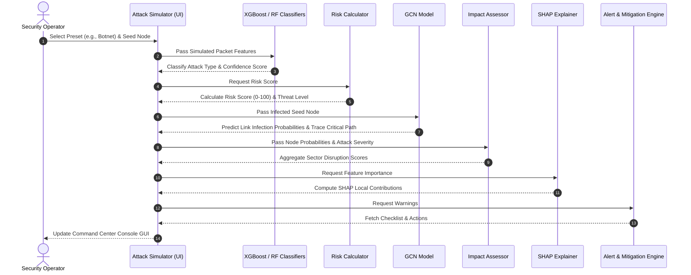

Explainable AI-Based Early Warning, Attack Propagation Prediction Using Graph Neural Networks (GNN), and Impact Assessment Framework for Smart City IoT Cybersecurity

This repository contains the complete implementation of a B.Tech final-year research project. The platform integrates machine learning classifiers, Graph Neural Networks (GNN), Explainable AI (SHAP), and domain-specific impact calculations into an interactive Streamlit Security Command Center.

---

## 🏗️ Research Architecture Diagram

```mermaid
graph TD
    subgraph Data Acquisition & Simulation
        D1[CICIoT2023 Dataset] --> P1[Data Preprocessing]
        D2[IoT-23 Dataset] --> P1
        D3[Custom 100-node Smart City Topology] --> G1[Graph Builder]
    end

    subgraph Cyber Threat Detection Engine
        P1 --> ML1[XGBoost Classifier]
        P1 --> ML2[Random Forest Classifier]
        ML1 --> CL1[Attack Label + Confidence]
        ML2 --> CL1
    end

    subgraph Early Warning Risk Engine
        CL1 --> RE[Risk Calculator]
        RE --> EW[Alert Generator]
    end

    subgraph Attack Propagation Modeling GNN
        G1 --> GCN[2-Layer custom PyTorch GCN]
        CL1 --> GCN
        GCN --> PP[Propagation Predictor]
        PP --> CP[Critical Path Tracer]
    end

    subgraph Impact Assessment Framework
        PP --> IA[Impact Assessor]
        IA --> SD[Sector Disruption Scores]
    end

    subgraph Explainable AI Core
        CL1 --> SHAP[SHAP TreeExplainer]
        SHAP --> LF[Local Feature Contribution Plots]
    end

    subgraph Security Command Center UI
        CL1 --> DB[Streamlit Dashboard]
        EW --> DB
        CP --> DB
        SD --> DB
        LF --> DB
    end
    
    style DB fill:#161b22,stroke:#58a6ff,stroke-width:2px;
    style GCN fill:#3f51b5,stroke:#fff,stroke-width:1px;
    style SHAP fill:#ff0051,stroke:#fff,stroke-width:1px;
```



---

## 🔄 System Workflow Diagram



---

## 🛠️ Step-by-Step Implementation Guide

### 1. Prerequisites and Setup
Ensure you have Python 3.8+ installed (Python 3.11 recommended).
1. Clone or copy the project files to your local environment.
2. Recommended project folder path:
   `C:\Users\ASUS-TUF\.gemini\antigravity\scratch\SmartCity-AI-EarlyWarning-GNN`

### 2. VS Code Setup Guide
1. Open VS Code and open the folder `SmartCity-AI-EarlyWarning-GNN`.
2. Install the recommended VS Code Extensions:
   - **Python** (Microsoft)
   - **Pylance** (Microsoft)
   - **Markdown All in One**
3. Select your python environment interpreter: `Ctrl+Shift+P` -> `Python: Select Interpreter` -> choose your python path.

### 3. Dataset Download Links
For replication using the actual raw datasets:
- **CICIoT2023**: [University of New Brunswick Dataset Portal](https://www.unb.ca/cic/datasets/ciciot2023.html)
- **IoT-23**: [Stratosphere IPS IoT-23 Datasets](https://www.stratosphereips.org/datasets-iot23)
*(Note: Running `python main.py` or launching the dashboard automatically bootstraps high-fidelity synthetic subsets for both datasets to ensure instant runnability).*

---

## 💻 Commands to Run the Modules

Run the following commands in your terminal or Command Prompt at the project root:

*   **Run End-to-End Pipeline (Generates Datasets, Trains ML/GNN, Generates Reports)**:
    ```bash
    python main.py
    ```
*   **Train Random Forest Classifier Only**:
    ```bash
    python train_rf.py
    ```
*   **Train XGBoost Classifier Only**:
    ```bash
    python train_xgboost.py
    ```
*   **Train Graph Neural Network Only**:
    ```bash
    python train_gnn.py
    ```
*   **Run Evaluations & Generate Report Artifacts**:
    ```bash
    python evaluate.py
    ```
*   **Launch Streamlit Command Center GUI**:
    ```bash
    streamlit run dashboard/app.py
    ```

---

## 🏁 Expected Outputs & Reports

The pipeline saves files under two primary folders:

### 1. `trained_models/`
- `random_forest.pkl`: Contains the trained RF model, StandardScaler, and LabelEncoder.
- `xgboost.pkl`: Contains the trained XGBoost model, scaler, and label encoder.
- `gnn_model.pt`: Holds the PyTorch GNN weights, adjacency matrices, and node lookups.

### 2. `results/`
- `accuracy_report.txt`: Summary of test set performance accuracies.
- `classification_report.txt`: F1, precision, and recall scores for each class.
- `confusion_matrix.png`: Multi-plot graphic of classifier confusion matrices.
- `shap_summary.png`: SHAP dot/summary plot showing feature importances.
- `propagation_graph.png`: Matplotlib rendering of GNN infection spread on the smart city topology.
- `impact_report.csv`: Sector disruption percentages spreadsheet.
- `pipeline.log`: Historical logger trace.

---


---

## 🚀 Deployment Guide & Future Scope

### Deployment Playbook
1. **Containerization**: Deploy the Streamlit dashboard and src modules in a lightweight Docker container.
2. **Data Ingestion**: Hook the inputs of `clean_data.py` to live Kafka packet streams from Zeek or Snort.
3. **Inference Loop**: Configure a cron job or daemon that runs prediction loops every 5 seconds, updating risk score registers.

### Future Scope
- **Dynamic Topology Learning**: Reconstruct the graph dynamically using ARP tables instead of static JSON maps.
- **Deep Reinforcement Learning (DRL)**: Hook the mitigation engine to a DRL agent to trigger automated containment (e.g., automated firewall updates).
- **Federated GNNs**: Enable cooperative GNN training across multiple smart cities without sharing raw private network logs.

--
